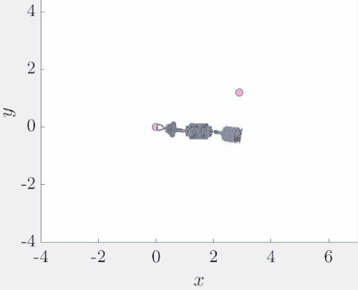

## Robotic Design Studio (RDS)
 [Demo Slides]()

Our group design an uneven bar gynmastic robot:
- Complete mechanical and electrical design of a three link robot
  * Top link is "hand", use pancake motor driven by ESC to grab the bar
  * Middle part is "muscles", contains two brushless motors driven by amplifier to rotate between links
  * Bottom part is "brain", contains E-stop, battery, Relay, two Roboteq amplifier.

- MatLab simulation of Giant Swing and release-catch
  * Use Euler-Lagrange equations to build the frame of a triple pendulum, simulate the swing and collision phase
  * Use energy-shape controller to pump up the robot
  * Use the position and velocity of the centroid to determine the time of releasing

   

## Pose Tracker
 [Hackaday Project](https://hackaday.io/project/172394-pose-tracker)

 [Demo Video](https://www.youtube.com/watch?v=8D80CxtRYak&feature=emb_logo)

Design a rotating camera to track human movement and evaluate posture
- Components: ESP CAM, Mini Pan-Tilt Kit, and FTDI
- Algorithm: PoseNet, tensorflow.js
- Use visual angle to track movements that increase robustness

   

## Glossy Percpetion
 [Demo Slides]()

Use statistics to understand glossy perception
- use subband analysis and histogram manipulation (s-curve, λ-curve) to estimate the glossiness of texture
- find the relations of subband histogram with generalized Gaussian function of textures

   

